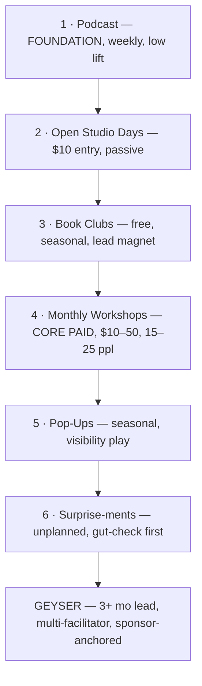
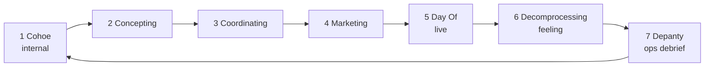
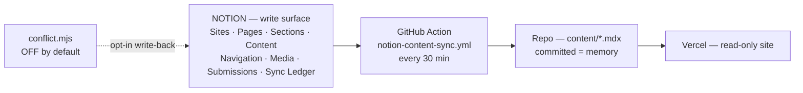

# CREATE WELL OS — ARCHITECTURE

2026 Edition · Las Vegas · flowing > forcing
Core rule: **one write surface per fact.** Notion writes. The repo remembers. The site reads.

---

## 0. Layer Stack

| Layer | Name | What lives here | Owner |
|---|---|---|---|
| L0 | Source | Podcast (weekly, evergreen) | Sunshine |
| L1 | Capacity | The Well — 6 offering levels + Geyser | Collective |
| L2 | People | Pillars, flowing support, host roster | Sunshine / Bingle / Monica |
| L3 | Rhythm | Monthly batch cycle, annual anchors | Cohoe |
| L4 | Flow | 7-phase event lifecycle | Phase owner |
| L5 | Data | Notion → repo → Vercel | Monica |
| L6 | Money | Tickets, sponsorships, tiered cuts | Sunshine + closer |

---

## 1. The Well (Capacity Architecture)

- Fills bottom-up; the source is tended before anything above it.
- L4 Workshops are the only mandatory paid node in a month.
- Geyser cannot be scheduled, only recognized — minimum 3-month runway.

---

## 2. Event Flow (Lifecycle Engine)

- Phases 1, 6, 7 are internal; 2–4 pre-event; 5 is the only public-facing node.
- Batched monthly: one Cohoe session sets the whole month in motion.
- Every yes *and* every no gets documented in Depanty — that's the learning loop.

---

## 3. Rhythm Loop (Monthly)

- Week 1 — Open Studio / Drop-in · content goes live, light promo.
- Week 2 — Open Studio / Drop-in · workshop promo ramps, sponsor confirmed.
- Week 3 — Workshop (core event) · Depanty follows. Every 3rd month → Geyser.
- Week 4 — Open Studio / Drop-in · reflect, batch next month in Cohoe.
- Annual anchors: Winter Solstice (Dec 21, reset) · Spring Equinox (Mar 20, emergence).

---

## 4. People Architecture (Redundancy by Design)

Rule: minimum two people on any event. No single absence stops the water.

| Node | Function | Mode |
|---|---|---|
| Sunshine | Vision + backend ops, assets, sponsorship strategy, creative direction | Remote-capable |
| Bingle | In-person presence, studio content, quarterly posing workshop | In-person |
| Monica | Systems + community bridge, grounding open, sponsor outreach | Async, open invitation |
| Event Support | Setup, collateral, welcoming; grows into hosting | Seasonal / flowing |

Host bench ladder: Observer → Shadow host → Solo host → Anchor host.
Outreach chain: Monica intro → Sunshine personal invite. Ask is always "shadow one first."

---

## 5. Data Architecture

- One-way by default: Status = Published in Notion → `content/<slug>.mdx`.
- Frontmatter carries title, slug, type, audience, externalId (Notion page id) as the join key.
- Write-back is deliberately disabled; enabling it requires hash comparison and a `Conflict` state in the Sync Ledger before resolution.

---

## 6. Revenue Architecture

| Stream | Range | Cadence |
|---|---|---|
| Open Studio + Drop-ins | $0–400 | Weekly, $10 entry |
| Monthly Workshop | $150–750 | 1x/month, ~15 ppl |
| Sponsorships | $300–1.5k | Per event, tiered |
| Geyser | +$1,500–5,000 | Quarterly max |

- Tickets are never the only line — sponsorships subsidize accessibility.
- Tiered cuts: closer gets the larger percentage, Sunshine takes a founder cut, business retains ops/growth.
- Payment triggers on **funds cleared**, not commitment. 7-day window.
- Popup shoots: Sunshine/Bingle 50/50, project-based.

---

## 7. Continuity Protocol (Sunshine Away)

Pre-departure gate — all must be true before wheels up:

- One month of flyers batched and scheduled.
- All event pages live with correct dates.
- Next workshop concept + promo assets built.
- Social scheduled 2+ weeks out.
- Sponsor target list + pitch templates shared with Monica.
- Event support identified and briefed; host run-of-show shared.
- At least one shadow host shift completed.
- Bingle briefed on open decisions.
- Final Cohoe held.

Failure mode this prevents: Create Well becoming one face instead of a collective.

---

## 8. What This OS Is Not

- Not productivity coaching.
- Not over-structured.
- Not a healing container — a nurturing one.
- Not a system that requires any single person to be present.
